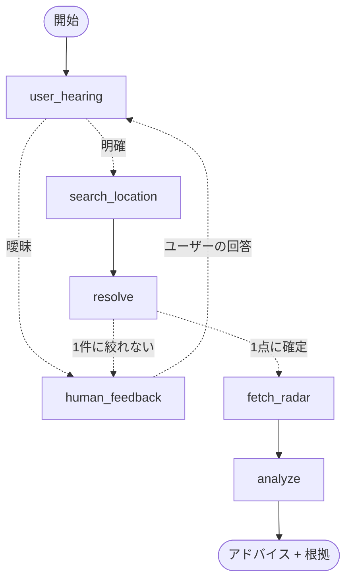

# 🌦️ Weather Report Buddy

[English](README.md) | 日本語

> 「傘いる？ あと何分もつ？」——この一問だけに答える、小さな会話エージェント。


## なぜ作ったか

まだ降っていないけれど、いかにも降りそうな日があります。30分後に友人とランチかもしれない。犬を散歩に連れ出したいかもしれない。軽く走りに行きたいかもしれない。

知りたいことは狭いはずです。**ここで**、この1時間のうちに雨は降るのか。何かすべきことはあるのか。ブラウザを開いてレーダーの地図を探し、自分の住んでいるあたりを見つけて、コマを1枚ずつ送る——問いの小ささに対して、作業が多すぎます。

なのでこれは、場所だけ聞いて、その問いにだけ答えます。

## 何をするか

場所を教えると、それが曖昧な場合は緯度経度が1点に決まるまで聞き返します。決まったらその地点の気象庁 高解像度降水ナウキャストを取得し、今後60分をレーダーアニメーションとして描いて、傘を持つべきか——そしてその根拠——を返します。

上のデモでは「新宿」は徒歩スケールで1点に絞るには広すぎるため、エージェントがより狭い地名を聞き返し、ユーザーが「新宿歌舞伎町」と答えています。

UI が日本語なのは、背後のナウキャストが日本国内限定のデータソースだからです。

## 使い方

Python 3.11+ と [uv](https://docs.astral.sh/uv/) が必要です。

```bash
uv sync
OPENAI_API_KEY=sk-... uv run streamlit run app.py
```

必須の設定は `OPENAI_API_KEY` だけです。上のようにコマンドに直接書いてもよいし、`.env.example` を `.env` にコピーしてそこに書いてもかまいません。ある程度の回数リクエストを投げるなら、`NOMINATIM_USER_AGENT` に自分を識別できる文字列（メールアドレス等）も設定してください（Nominatim の利用ポリシーで求められています）。

## どう作られているか

コンパイル後のグラフ（`agent.get_graph().draw_mermaid()` の出力そのまま）:



```
app.py                        Streamlit チャット UI + レーダーのコマ送りプレイヤー
buddy/
├── settings.py               環境変数とモデルの設定
├── tools/
│   ├── geocode.py            Nominatim。通称は Web 検索でフォールバック
│   └── radar.py              気象庁ナウキャストのタイルを地理院地図に合成
└── agent/
    ├── state.py              グラフの状態と2つの出力スキーマ
    ├── graph.py              上のグラフ
    └── chains/
        ├── hearing_chain.py  場所は曖昧か？ 何を聞き返すか？
        ├── resolve_chain.py  候補 → 1点の緯度経度（選定理由つき）
        ├── analyze_chain.py  時系列画像の Vision 分析
        └── prompts/          チェーンごとに1つの .prompt
scripts/debug_hearing.py      曖昧さ判定だけを単体で叩く CLI
```

LangGraph（状態 + `interrupt()`）、Streamlit、OpenAI のモデル2つ——場所の解決に小さいモデル、レーダーの読み取りに Vision モデル。約950行。詳細仕様は [SPEC.ja.md](SPEC.ja.md)。

とくに挙げておきたい判断が3つあります。

- **聞き返しはリトライループではなく human-in-the-loop の interrupt。** 足りないのはユーザーの意図であって、モデルのサンプリング結果ではありません。同じプロンプトを引き直しても取り戻せない情報です。なお聞き返しの入口は**2箇所**あります（最初の曖昧さ判定と、候補の緯度経度が1件に絞れなかった時点）。
- **レーダーは zoom 14（およそ7km四方）で描く。県全体ではない。** 問うているのは「この1時間のうちに**自分のいる区画**まで雨が来るか」です。気象庁のタイルは zoom 10 が上限なので、より細かい地図の上に拡大して重ねています。
- **Vision モデルには1枚の画像ではなく、ラベル付きの時系列を渡す。** 各コマに時刻とオフセットを前置しています。アドバイスは雨雲がどちらへどの速さで動いているかに依存し、1枚のスナップショットでは決まらないからです。

## 意図的に作らなかったもの

- **気象業務法のガード** — 日本では予報の発表が気象業務法で規制されています。これは個人利用の PoC であり、許可を受けた予報業務ではありません。
- **アプリ内の i18n** — データソースが日本限定なので UI は日本語のままにしました。代わりにドキュメントをバイリンガルにしています。
- **永続化 / 複数地点の同時監視** — 上に書いた「ひとつの問い」の範囲外です。

## クレジット

- 雨雲レーダー: [気象庁](https://www.jma.go.jp/) 高解像度降水ナウキャスト
- 地図タイル: [国土地理院](https://maps.gsi.go.jp/development/ichiran.html)
- ジオコーディング: [Nominatim / OpenStreetMap](https://nominatim.org/)
