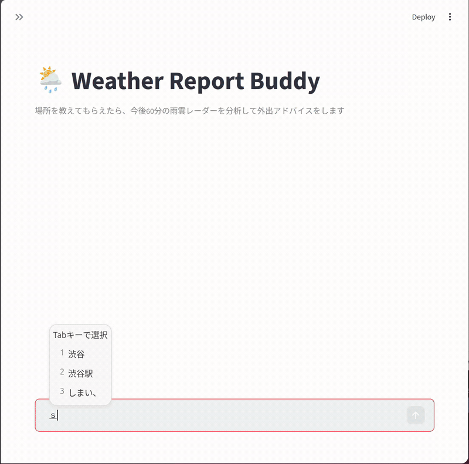
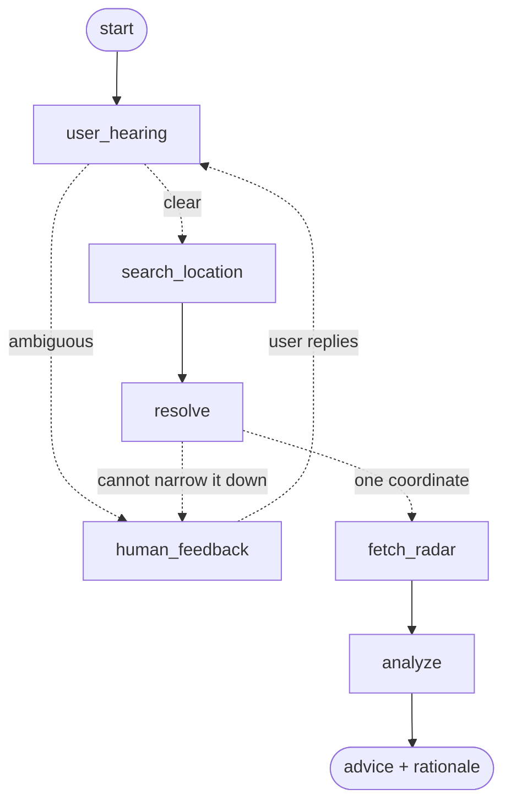

# 🌦️ Weather Report Buddy

> A small conversational agent for one question: *"Tell me if I need an umbrella — and how long I've got."*



## Why

Some days it is not raining yet, but it clearly might. You have lunch with a friend in half an hour. You want to take the dog out, or get a short run in.

What you want to know is narrow: will it rain **here**, within the hour, and do I need to do anything about it? Opening a browser, finding a radar map, locating your own neighbourhood on it and stepping through the frames is more work than the question deserves.

So this asks you where you are, and answers exactly that.

## What it does

You tell it a place. If the place is ambiguous, it asks you back until it can resolve a single coordinate. Then it pulls the Japan Meteorological Agency high-resolution precipitation nowcast for that exact point, renders the next 60 minutes as a radar animation, and tells you whether to take an umbrella — and why.

In the demo above, *Shinjuku* is too broad to pin down at walking scale, so the agent asks for a narrower name and the user answers *Shinjuku Kabukicho*.

The UI is Japanese, because the nowcast behind it is a Japan-only data source.

## Quick start

Requires Python 3.11+ and [uv](https://docs.astral.sh/uv/).

```bash
uv sync
OPENAI_API_KEY=sk-... uv run streamlit run app.py
```

`OPENAI_API_KEY` is the only required setting. You can either pass it inline as above, or copy `.env.example` to `.env` and put it there. If you plan to make more than a handful of requests, also set `NOMINATIM_USER_AGENT` to something that identifies you — Nominatim's usage policy asks for it.

## How it's built

The compiled graph, as emitted by `agent.get_graph().draw_mermaid()`:



```
app.py                        Streamlit chat UI + radar frame player
buddy/
├── settings.py               environment and model configuration
├── tools/
│   ├── geocode.py            Nominatim, with a web-search fallback for nicknames
│   └── radar.py              JMA nowcast tiles composited onto a GSI base map
└── agent/
    ├── state.py              graph state and the two output schemas
    ├── graph.py              the graph above
    └── chains/
        ├── hearing_chain.py  is the place ambiguous? what to ask back?
        ├── resolve_chain.py  candidates → one coordinate, with a reason
        ├── analyze_chain.py  vision analysis of the frame sequence
        └── prompts/          one .prompt file per chain
scripts/debug_hearing.py      exercise the ambiguity judgement on its own
```

LangGraph (state + `interrupt()`), Streamlit, and two OpenAI models — a small one to resolve the place, a vision one to read the radar. ~950 lines. Fuller spec in [SPEC.md](SPEC.md) (Japanese).

Three choices worth calling out:

- **Clarification is a human-in-the-loop interrupt, not a retry loop.** What is missing is the user's intent, not a better sample from the model, so retrying the same prompt cannot recover it. Note that *two* nodes can ask you back: the first ambiguity check, and the point where candidate coordinates fail to narrow to one.
- **The radar is rendered at zoom 14 — roughly 7 km across — not prefecture-wide.** The question is whether rain reaches *your block* within the hour. JMA's tiles top out at zoom 10, so they are upscaled over a finer base map.
- **The vision model gets a labelled time sequence, not one image.** Each frame is prefixed with its clock time and offset, because the advice depends on which way the rain is moving and how fast, not on a single snapshot.

## Deliberately not built

- **Regulatory guard** — publishing forecasts in Japan is regulated under the Meteorological Service Act. This is a personal PoC, not a licensed service.
- **In-app i18n** — the UI stays Japanese because the data source is Japan-only. The docs are bilingual instead.
- **Persistence / multi-location watch** — out of scope for the one question above.

## Credits

- Precipitation nowcast: [JMA](https://www.jma.go.jp/) high-resolution nowcast
- Map tiles: [GSI](https://maps.gsi.go.jp/development/ichiran.html)
- Geocoding: [Nominatim / OpenStreetMap](https://nominatim.org/)
